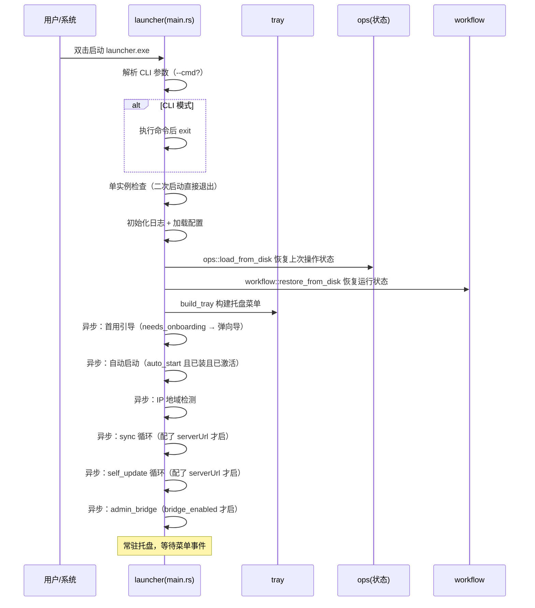
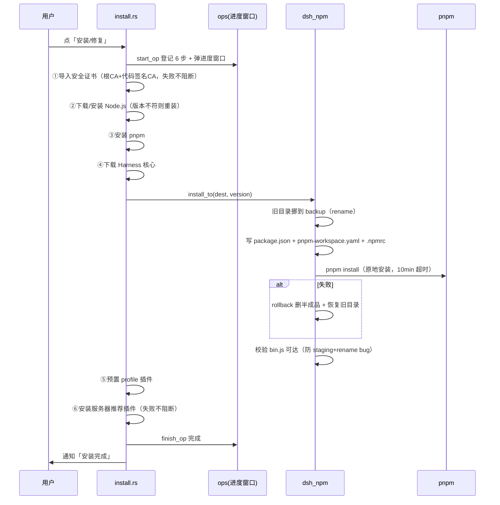
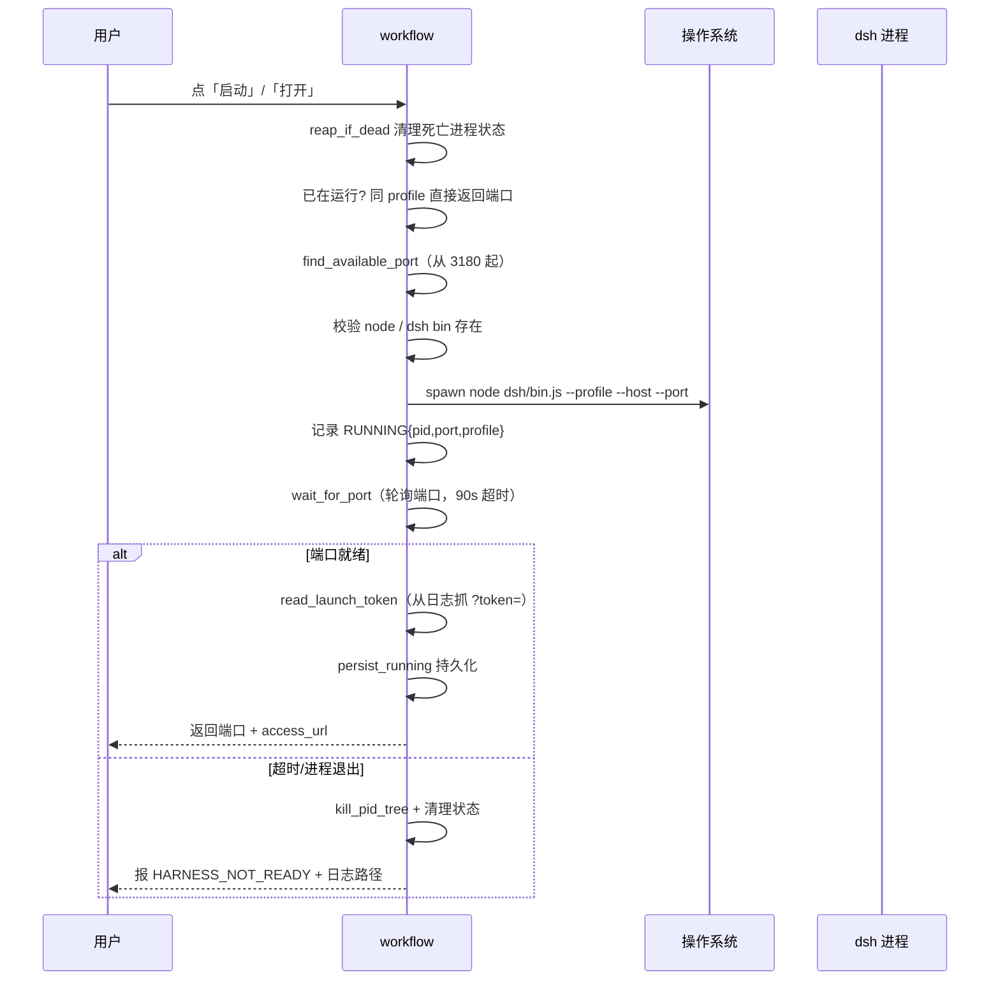
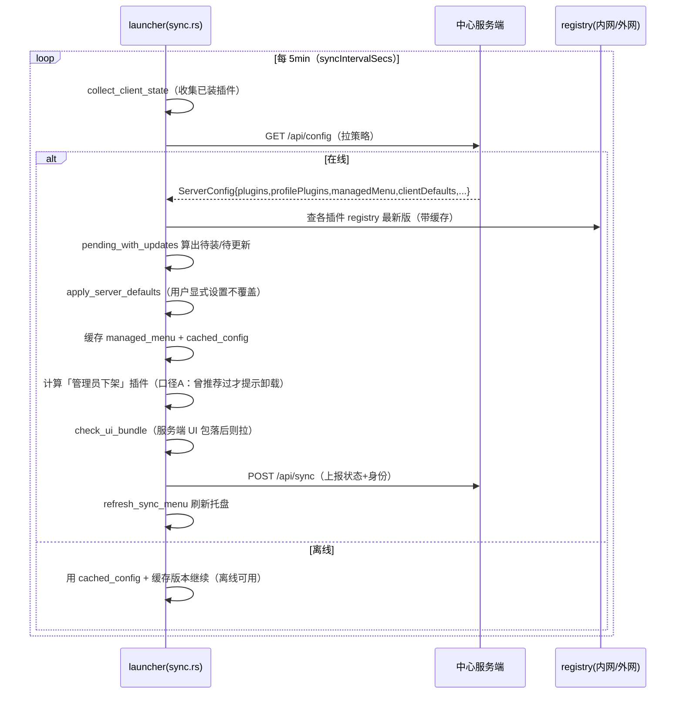
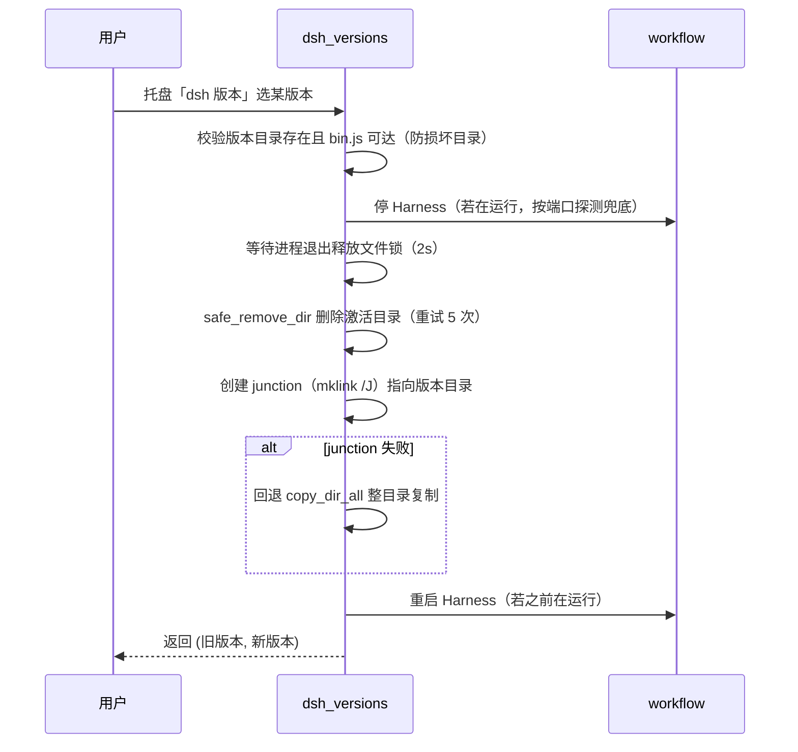
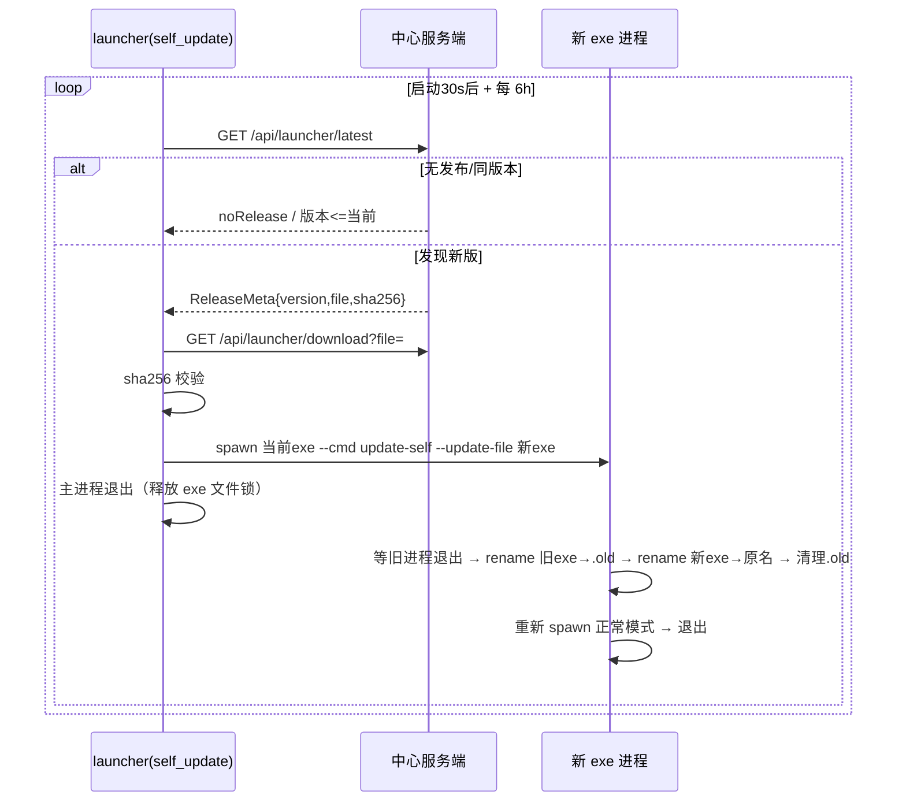
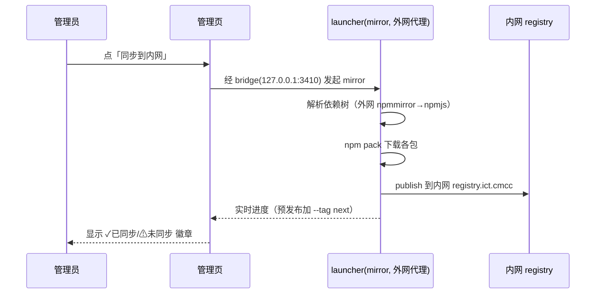

# DeepSeek Harness Launcher 现状梳理与序列图

> 目的：把 launcher「现在到底实现了什么功能、什么流程」讲清楚，附序列图，供评审与后续版本管理改造参考。
> 范围：`deepseek-harness-launcher`（客户端托盘，Rust/Tauri 2）+ `dsh-launcher-center`（中心服务端，纯 Node）。
> 梳理依据：`src-tauri/src/*.rs`（30 文件，约 1.2MB）+ `dsh-launcher-center/src/*.js`（20 文件）。

---

## 1. 整体架构

```
┌─────────────────────────────────────────────────────────────────────┐
│                        中心服务端  dsh-launcher-center               │
│  server.js (端口 8081，生产由 caddy/launcher-server.cjs 以 pm2 拉起)  │
│  · /api/config      下发插件策略/菜单策略/clientDefaults/envDefaults │
│  · /api/sync        接收客户端状态上报                                │
│  · /api/launcher/*  launcher exe 发布与自动更新                       │
│  · /admin           管理控制台（策略编辑/客户端状态/镜像同步）          │
└───────────────┬─────────────────────────────────────────────────────┘
                │ HTTP（内网 http://conf.ai.ict.cmcc → 8081）
┌───────────────▼─────────────────────────────────────────────────────┐
│                客户端  deepseek-harness-launcher（托盘常驻）          │
│  同步循环 sync::spawn_sync_loop —— 每 5min 拉配置 + 上报状态          │
│  自更新 self_update::spawn_self_update_loop —— 每 6h 查 launcher 新版│
│  安装引擎 install::install_all —— Node/pnpm/dsh核心/插件              │
│  进程管理 workflow::launch/stop —— 启动/停止 Harness                  │
│  版本管理 dsh_versions —— 多版本共存 + 切换                           │
└───────────────┬─────────────────────────────────────────────────────┘
                │ 启动子进程  node dsh/lib/bin.js --profile matrix
┌───────────────▼─────────────────────────────────────────────────────┐
│            DeepSeek Harness（dsh 核心，npm 包 @deepseek-ai/dsh）     │
│  本地 HTTP 127.0.0.1:3180（默认），运行数字分身 matrix / web 等 profile│
└─────────────────────────────────────────────────────────────────────┘
```

### 1.1 客户端源码文件职责（src-tauri/src/）

| 文件 | 大小 | 职责 |
|---|---|---|
| main.rs | 14KB | 入口：CLI/常驻双模式、单实例保护、注册 4 个 URI scheme（console/matrix-setup/first-run）|
| tray.rs | 100KB | **托盘菜单构建 + 全部菜单事件处理**（最大最复杂）|
| config.rs | 71KB | 配置结构、加载/合并/保存、地域检测、路径常量 |
| sync.rs | 78KB | **企业同步**：拉配置、上报状态、插件增删、版本检查 |
| install.rs | 62KB | 安装引擎 install_all、证书导入、profile 预置、launcher-brand |
| workflow.rs | 34KB | Harness 进程启动/停止、端口探测、token 抓取 |
| matrix_setup.rs | 66KB | 数字分身（matrix）配置向导窗口 + 激活流程 |
| mirror.rs | 53KB | 镜像上传（插件+依赖 → 内网 registry）|
| dsh_versions.rs | 24KB | dsh 多版本共存、检查更新、切换版本 |
| dsh_npm.rs | 19KB | dsh 核心 npm 安装（原地安装+回滚）|
| self_update.rs | 25KB | launcher 自身 exe 自动更新 |
| activation.rs | 37KB | 激活/许可证 |
| admin_bridge.rs | 32KB | 本地管理 API（外网代理网关，127.0.0.1:3410）|
| download.rs | 22KB | 下载引擎（多源+断点续传+sha256）|
| ops.rs | 26KB | 操作进度窗口状态机 |
| 其余 | - | cli/commands/console/domain_migrate/env_defaults/embedded/first_run/logging/logpack/notify/plugin/reset/speedtest/ui_bundle |

### 1.2 服务端源码文件职责（dsh-launcher-center/src/）

| 文件 | 职责 |
|---|---|
| server.js / app.js / router.js / args.js / http.js | HTTP 框架（零依赖 node:http）|
| routes/config.js | `/api/config` 策略下发（校验 + 合并写入）|
| routes/sync.js | `/api/sync` 客户端上报 |
| routes/launcher.js | `/api/launcher/*` exe 发布 + 下载 |
| routes/mirror.js / registry.js | 镜像同步状态查询 |
| store/clients.js | 客户端状态存储（data/clients/*.json）|
| store/config.js | 策略存储（data/config.json）|
| store/launcherReleases.js | launcher 发布物元数据 |
| views/adminPage.js | 管理页（32KB，最大）|
| web/*.js | 管理页前端各模块（config/plugins/npm/clients/bridge/menu/launcher）|

---

## 2. 功能清单（现在实现了什么）

### 2.1 客户端核心能力

1. **安装/修复引擎**（install_all）：一键装齐 Node.js → pnpm → dsh 核心 → 预置插件 → 服务器推荐插件。含内网根证书 + 代码签名根证书导入。
2. **启动/停止 Harness**（workflow）：`node dsh/bin.js --profile <p> --host 127.0.0.1 --port <p>`，Windows CREATE_NO_WINDOW，退出 taskkill /T /F 回收进程树，PID+端口+profile 记录 + 存活校验。
3. **多 Profile 切换**：枚举 profiles/ 下 profile（默认 matrix 数字分身、web 常规），切换 = 停当前 → 启新 profile，端口/插件隔离。
4. **数字分身（matrix profile）**：预置 dsh-matrix-agent + launcher-brand + 内置 dsh-web-app，向导式激活（认领账号）。
5. **dsh 版本管理**（dsh_versions）：多版本共存（dsh-versions/<tag>/）、列出、下载指定版本、切换激活（junction 原子替换）。
6. **加速设置**：npm 源（自动/官方/npmmirror）、GitHub 中转，多源数组按序尝试，测速选最快，IP 地域判定。
7. **企业同步**：定期拉插件策略 + 菜单策略 + clientDefaults，自动装缺的插件，上报本机状态。
8. **管理能力（外网代理网关）**：管理员本机 127.0.0.1:3410 起本地 API，服务端经此中转查外网 npm。
9. **镜像上传**：把插件+依赖上传内网 registry，管理页显示同步状态徽章。
10. **launcher 自身自动更新**：启动 30s 后 + 每 6h 轮询 `/api/launcher/latest`，发现新版下载→sha256→替换 exe→重启。
11. **员工身份上报**：SSO 登录取 Keycloak name claim 写入 settings.yaml，随同步上报。
12. **CLI/IPC 双通道**：`--cmd` 一次性执行 + IPC 供常驻实例调用。
13. **单实例保护**、**数据隔离**（$DSH_HOME 默认 ~/.dsh-launcher）。

### 2.2 服务端能力

1. **策略下发**：plugins（应装清单）/ profilePlugins（按 profile）/ managedMenu（托盘菜单）/ clientDefaults（默认配置）/ envDefaults（settings.yaml）/ jobPresets（预装岗位）/ uiBundle（本地窗口 HTML）。
2. **客户端状态收集**：每台客户端的插件明细、待装、菜单、配置、版本、身份。
3. **launcher 发布**：管理员上传 exe → 客户端自动更新。
4. **镜像同步状态**：查内网 registry 各包是否已同步。

---

## 3. 关键流程序列图

### 3.1 启动流程（launcher 常驻启动）



### 3.2 安装流程（install_all）



### 3.3 启动 Harness 流程（workflow::launch）



### 3.4 企业同步流程（sync::sync_once）



### 3.5 dsh 版本切换流程（dsh_versions::switch_version）



### 3.6 launcher 自更新流程（self_update）



### 3.7 镜像上传流程（mirror.rs，管理员）



---

## 4. 版本管理现状（重点：与你三版本方案的关系）

### 4.1 现在已有的「版本」相关机制

| 机制 | 字段 | 现状 | 局限 |
|---|---|---|---|
| **dsh 核心固定版本** | `clientDefaults.dshVersion` | 服务端下发，全员装同一版 dsh | 只覆盖 dsh 核心，**不含插件版本** |
| **dsh 版本通道** | `clientDefaults.dshChannel` | `rc`(默认，排除 alpha/beta/dev) / `alpha`(全量) | 只有 2 档，只给 dsh 核心用，**不是发布通道语义** |
| **插件应装清单** | `plugins` / `profilePlugins` | 只列包名，**不带版本号**，装 latest | 无法锁定插件版本组合 |
| **launcher 自身版本** | 三处（package.json/Cargo.toml/tauri.conf.json）| 自动更新按「严格大于」比较 | 只管理 launcher exe 自己 |
| **UI 包版本** | `uiBundle.version` | 本地窗口 HTML 服务端下发 | 独立通道，与整体版本无联动 |

### 4.2 关键结论（与你的诉求对照）

你现在提的「**版本号 = DSH 版本 + 每个定制插件版本 + 岗位**」目前在系统里是**割裂的三块**：

1. **DSH 版本**：有 `dshVersion` 固定版本机制，但没有「发布/预览/开发」三通道。
2. **插件版本**：`plugins` 清单**只有名字没有版本**，无法表达「版本组合」。
3. **岗位**：有 `jobPresets`（预装岗位清单，也是名字列表，无版本）。

而「**正式版（测试过才能发布）/ 预览版（灰度）/ 开发版（开发者自测）**」这三种版本，目前**完全没有对应的概念**——现有 `dshChannel` 的 rc/alpha 只是 dsh 核心的「预发布标签过滤」，不是面向「发布通道/受众」的分级。

**→ 你的三版本方案，本质是要把上面这些割裂机制，收口成一套统一的「版本组合 + 发布通道」体系。** 具体设计见《版本管理方案》文档（下一步产出）。

---

## 5. 已知的版本/更新相关 bug（来自代码注释与记忆）

| # | 问题 | 状态 |
|---|---|---|
| 1 | 固定版本模式下「📥 安装」菜单项不渲染（dsh_versions check_update 跳过缓存，tray 读缓存为空）| 代码已含修复（L414-426 固定版本也注入缓存），待验证 |
| 2 | dsh 安装 registry 选择：服务端 dshRegistry 与 mirrorSettings.registry 字段对不上 → 掉地域源 | 记忆已记，需改三处 |
| 3 | staging+rename 导致 node_modules 链接指向旧路径 → 已改为「原地安装+回滚」| 已修复 |
| 4 | launcher 三处版本号必须逐字相等，否则自更新失效且不报错 | 有 check-version.mjs 护栏 + CI 校验 |

---

## 6. 附录：完整流程清单（供逐条评审）

**启动期**：单实例 → 日志 → 配置 → 恢复状态 → 托盘 → 首用引导 → 自动启动 → 地域检测 → 同步循环 → 自更新循环 → 管理网关。

**安装期**：证书 → Node → pnpm → dsh核心 → 预置插件 → 推荐插件 → 补 bundle patch。

**运行期**：启动/停止/切换 profile、dsh 版本切换、插件增删/更新、测速、镜像上传、同步、自更新、打开进度窗口、退出。

**向导期**：首次激活（first-run）→ 数字分身配置（matrix-setup）→ 找回会话（reset）。

（序列图 Mermaid 语法需在支持 Mermaid 的预览器查看；纯文本阅读可只看箭头与说明。）
